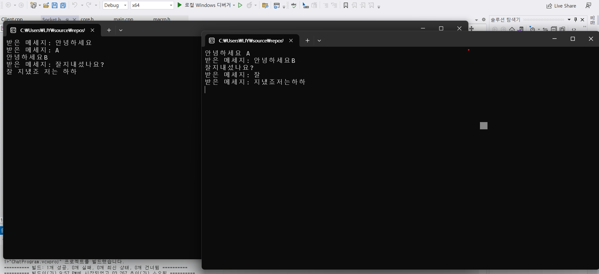
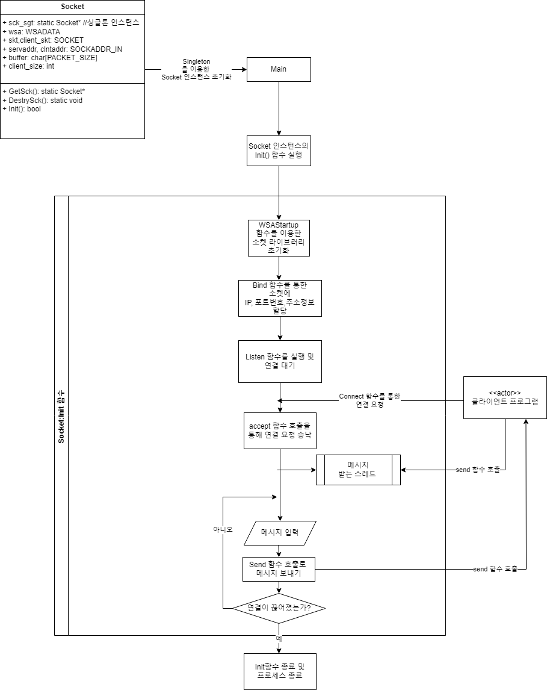

# SimpleChatProgram (간단한 채팅 프로그램)

  

## 설명

윈도우 소켓 라이브러리 사용 연습겸 만든 콘솔창 기반 채팅 프로그램입니다.  
**ChatProgram** 폴더에 서버 역할을 하는 프로그램이 들어있고,  
**ChatProgramClient** 폴더에 클라이언트 역할을 하는 프로그램이 있습니다.  

사용법은 서버를 먼저 켜시고, 이후에 클라이언트를 키시면 자동으로 연결됩니다.

## 코드 구조 다이어그램

**ChatProgram**, 즉 서버 프로그램의 다이어그램입니다.  
클라이언트 코드도 이와 비슷한 구조를 갖추고 있으므로, 이 다이어그램을 보면 클라이언트도 이해하기 쉽습니다.  

  

